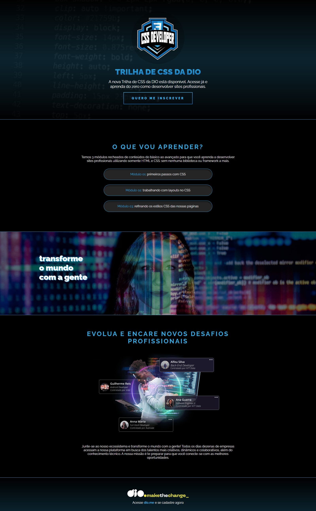

# Projeto CSS - Desafio Dio.me

Este repositório contém o primeiro projeto do curso de CSS da [Dio.me](https://www.dio.me/), no qual o objetivo principal foi aplicar estilos personalizados a uma estrutura HTML previamente fornecida.

## 💻 Sobre o Projeto

O HTML e a estrutura de classes/IDs foram disponibilizados pelo instrutor do curso. O desafio consistiu exclusivamente na criação e aplicação do **CSS**, incluindo:

- Definição de cores, fontes e tamanhos;
- Posicionamento de elementos;
- Efeitos visuais com gradientes e transparência;
- Responsividade básica e estilização visual de seções como banner, módulos e rodapé.

## 🎯 Objetivo

Praticar os conceitos fundamentais de CSS, como:

- Seletores e classes;
- Box model e espaçamentos;
- Gradientes e efeitos com background;
- Tipografia com `@import` de fontes;
- Estilização de botões, textos e imagens.

## ✅ Resultado

O projeto final apresenta uma landing page visualmente moderna, com destaque para o uso de gradientes e efeitos visuais, respeitando o layout proposto no desafio.

## 📸 Prévia

> *Imagem ilustrativa da landing page estilizada com CSS.*

## 🔗 Visualização do Projeto

Você pode visualizar o projeto em funcionamento acessando:

[**Link da Página**](https://luis-fellipe.github.io/landing-page-css/)  

## 📌 Observações

- Esse projeto foi um exercício prático de CSS, portanto o foco está na estilização e não na estrutura semântica do HTML.
- O conteúdo textual e estrutura foram fornecidos pelo curso.
